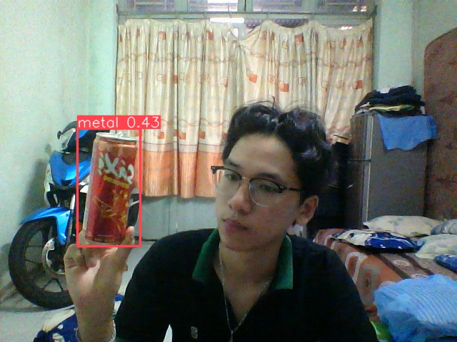
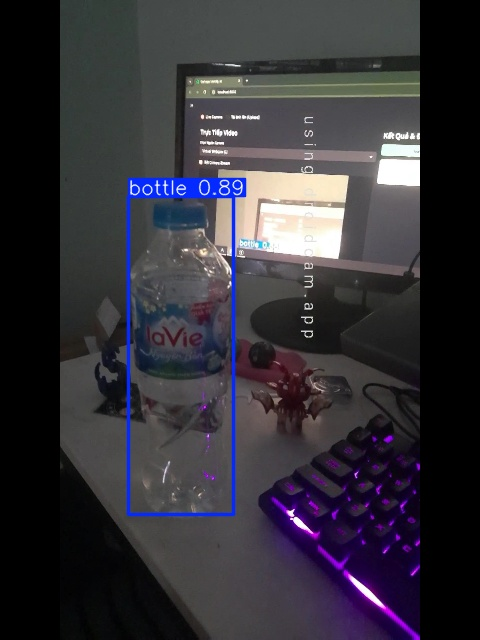

# ♻️ Garbage Identify AI – Waste Detection & Classification

A smart web application that uses the **YOLOv8 model** to detect and classify different types of waste in real time through a camera or uploaded images. The project is developed using **Python** and the **Streamlit** framework.

---

## ✨ Key Features

- **Multi-source detection:**  
  Supports live camera input (Webcam/IP Camera) and image uploads from a computer.

- **Smart classification:**  
  Automatically categorizes waste into four main groups:
  - ♻️ Plastic waste  
  - 🧱 Solid waste  
  - 🛍️ Nylon  
  - 💉 Medical waste  

- **History storage:**  
  Allows users to capture screenshots and save detection results with timestamps for later review.

- **Modern interface:**  
  Clean and user-friendly UI with custom CSS styling.

---

## 🛠 Technologies Used

- **AI Model:** YOLOv8 (Ultralytics)  
- **Web Framework:** Streamlit  
- **Computer Vision:** OpenCV  
- **Programming Language:** Python 3.12+  

---

## 🚀 Installation Guide

### 1. Clone repository

git clone https://github.com/poromvp/garbage-identify-ai.git
cd garbage-identify-ai

### 2. Create virtual environment (recommended)
python -m venv venv

# Windows
venv\Scripts\activate

# Linux/Mac
source venv/bin/activate

### 3. Install dependencies
pip install -r requirements.txt

### ▶️ Run the Application
streamlit run app.py

### 📌 Notes
Make sure your camera is accessible if using live detection.
Ensure all dependencies are installed correctly.
Python 3.12+ is recommended for best compatibility.

---
## 📷 Demo

### 🔍 Detection Example


### 🎥 Live Camera


```bash